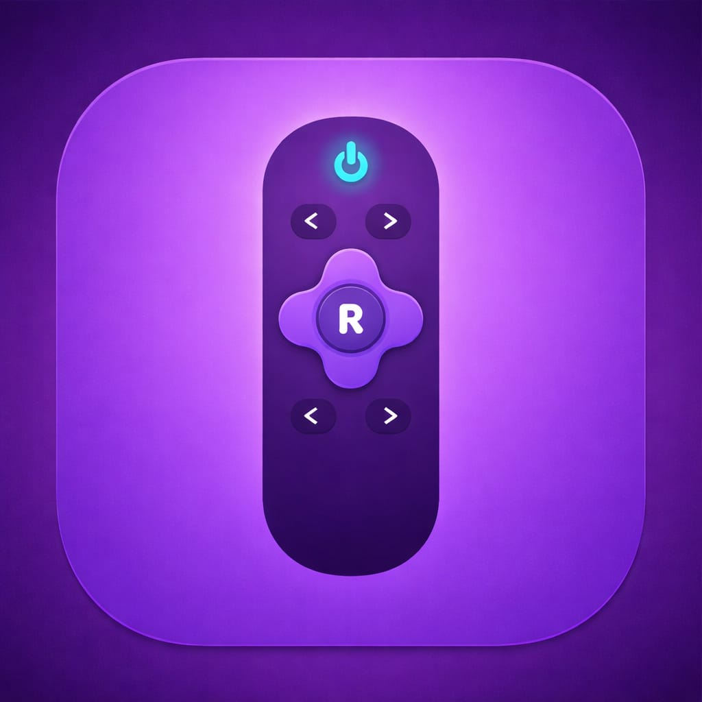
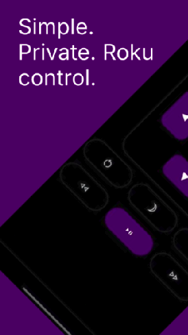
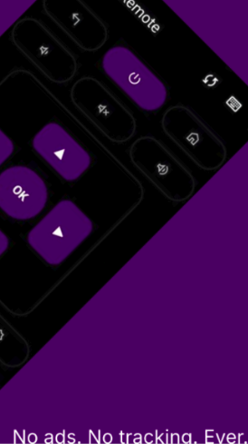
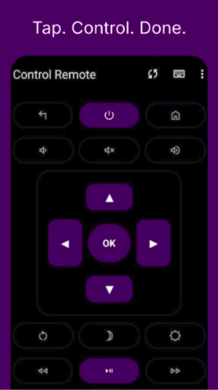
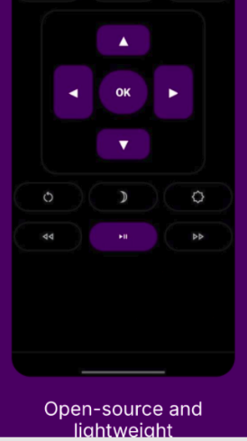

  

<h1 align="center"><b>Open Rokiu</b></h1>

<h4 align="center">A simple, private remote control for Roku TVs.</h4>

  
  
  
  

  

---

## About

**Open Rokiu** is a free and open-source remote control application for Roku devices.

It allows you to control your Roku TV directly from your phone using your local network — no cloud, no tracking, no unnecessary dependencies.

In short: **It just controls your TV.**

---

## Screenshots

  <table>
    <tr>
      <td></td>
      <td></td>
    </tr>
    <tr>
      <td></td>
      <td></td>
    </tr>
  </table>

---

## Features

* Automatic Roku device discovery (LAN)
* Full remote control (navigation, playback)
* Launch channels directly
* Text input support
* Clean, minimal UI (light & dark mode)
* Fast and lightweight
* Works entirely offline (local network only)

---

## Privacy

Open Rokiu is designed with privacy in mind:

* No ads
* No tracking
* No analytics
* No Google Play Services
* No external internet communication
* Local network only

> Your data never leaves your device.

---

## Permissions

* **INTERNET**
  Used only for local communication with Roku devices via ECP.

* **VIBRATE**
  Used for haptic feedback on button presses.

---

## Getting Started

1. Connect your phone and Roku device to the same Wi-Fi network
2. Open **Open Rokiu**
3. Select your Roku device
4. Start controlling your TV

---

## Installation

* F-Droid *(coming soon)*
* APK via GitHub Releases

---

## Tech Stack

* Kotlin
* Android SDK (Google-free)
* Roku External Control Protocol (ECP)
* Local network (LAN communication)

---

## Contributing

Contributions are welcome!

* Report bugs
* Suggest improvements
* Submit pull requests

---

## License

  

Open Rokiu is Free Software: you can use, study, share, and improve it under the terms of the **GNU General Public License v3.0**.
